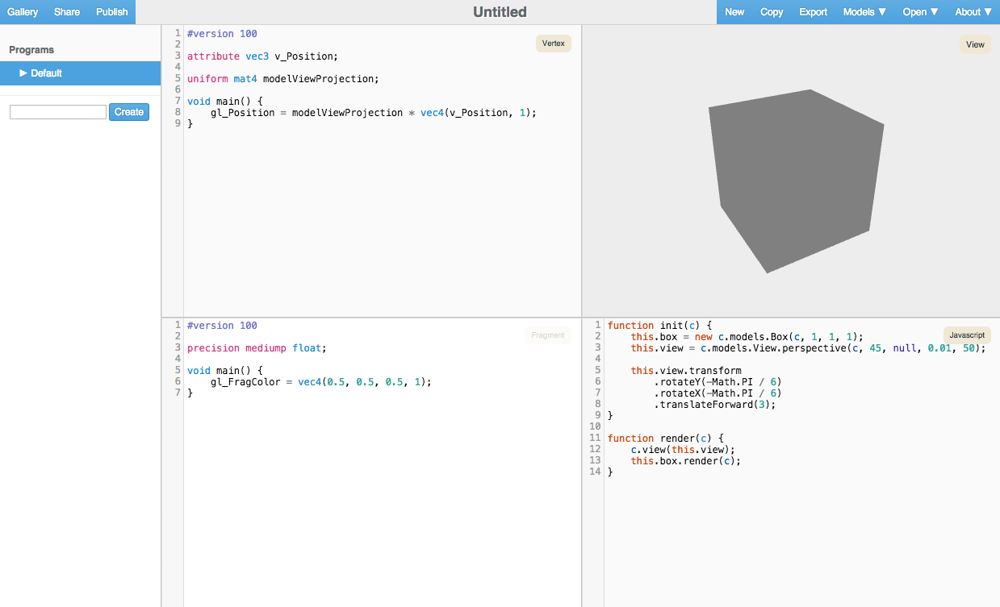

# &nbsp; WebGL Playground

Visit http://jessevdk.github.io/webgl-play to start right now!

The WebGL Playground is a web-based, live editing environment primarily
created to allow easy experimenting with WebGL. The main editor consists
of a vertex shader editor, fragment shader editor, JavaScript editor and
a live view of the current rendering. Rendering updates automatically as
you type, while reporting any errors inline in the editors. A simple UI
system allows you to create interactive demos.

The playground provides a number of convenient objects and methods to handle
the menial parts of the GL API. Your focus should be mainly on experimenting
with interesting rendering shaders and not surrounding WebGL boilerplate.
At the same time however, the conveniences should not introduce too much
"magic", so it's kept reasonably straight-forward and linear.

# Getting Started
If you want to get started right away, please visit
http://jessevdk.github.io/webgl-play for the official instance of the
playground. Here you can look at examples from the gallery, create new
experiments and share them as you like.

You can also run the playground very easily locally, or on your own server.
Please see [INSTALL.md](INSTALL.md) for more information on installing the playground.

# Building
For specific build instructions please see [BUILD.md](BUILD.md)

# Structure of this repository
The general structure of this repository is as follows:

  * [css/](css/): all the website style sheets. The playground uses SASS and the
              main entry point is [css/site.scss](css/site.scss). Normal .css files are
              vendored from external sources.
  * [docs/](docs/): WebGL specific documentation.
  * [githooks/](githooks/): useful githooks used during development.
  * [html/](html/): the website html files.
  * [icons/](icons/): icons of various sizes, as well as the .blend file
                from which the icons are rendered.
  * [js/](js/): all the website JavaScript files. Files are distributed over
             various (mostly self-contained) subdirectories. The playground
             uses browserify to merge all JavaScript together, and the main
             entry point is [js/site.js](js/site.js). Externally vendored JavaScript
             files reside in [js/vendor/](js/vendor/).
  * [models/](models/): high poly sample models available directly in the playground,
                 including the Stanford Bunny, Buddha, Dragon, Utah Teapot
                 and Blender Suzanne.
  * [scripts/](scripts/): various scripts used for building the final website.
  * [server/](server/): a server for the playground maintaining shared documents
                 and the gallery. See [server/README.md](server/README.md) for more
                 information.
  * [site/](site/): pre-generated site. You can point your browser to this locally
               after a checkout.

